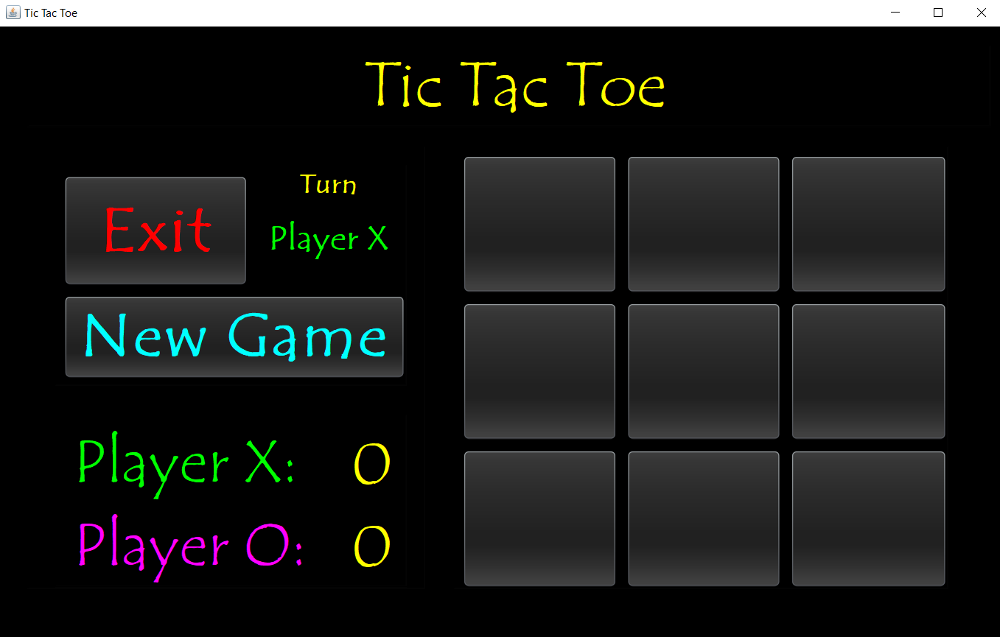

# Tic-Tac-Toe
- **PDF Presentation:** [Tic Tac Toe.pdf](https://drive.google.com/file/d/1kMALYqhMI92c4mv7dYavA7wG9njj7VzZ/view) 
- **Prototype & GUI Design (Greek):** [Tic Tac Toe Prototype + Design.pdf](https://drive.google.com/file/d/1HFUzeubUs8jgrqVNMCbdwAQyKXSBesvn/view?usp=sharing) 
- **Detailed Implementation (Greek):** [Tic Tac Toe.doc](https://docs.google.com/document/d/1UVQnFbjzsuxP46fCIExRuU_YT4fK58z0/edit?usp=sharing&ouid=114041209662107631365&rtpof=true&sd=true) 

- **Short Description:** A neon-colored PC version of the well-known game "Tic Tac Toe". The game was created in **NeBeans**, programmed with **Java** and the GUI was designed with **JavaSwing**.
